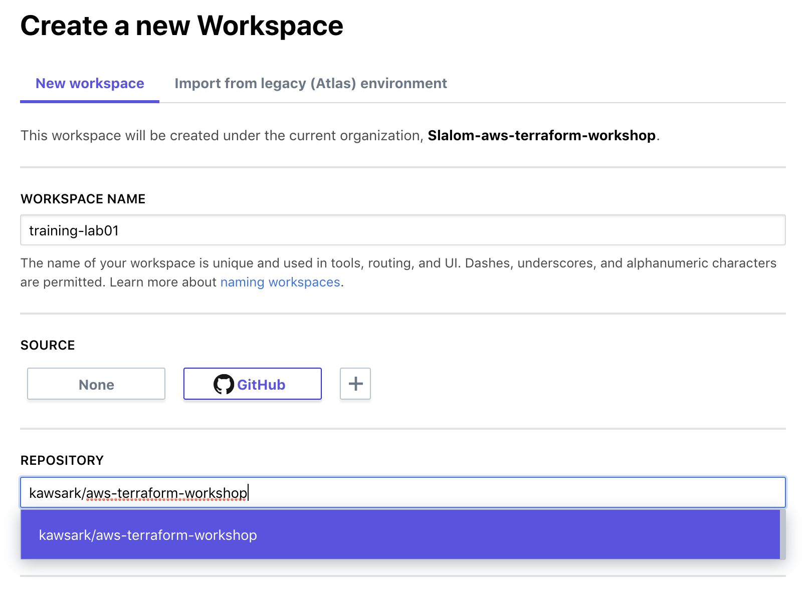
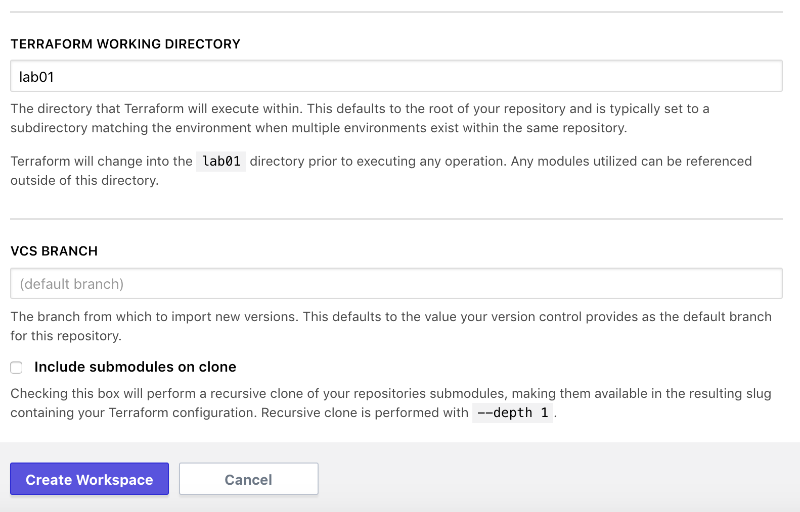

## Getting Started with Terraform Enterprise

Duration: 45 minutes

This lab demonstrates how to create a Workspace in Terraform Enterprise using the UI. This is called a [UI-driven run workflow](https://www.terraform.io/docs/enterprise/run/ui.html).

This lab is for use with a student's own AWS credentials and is intended to run on Terraform Enterprise, however, it an also be run locally, see [local.md](local.md) for steps.

The Terraform configuration in this directory will provision one or more AWS EC2 instances and deploy an example Go application. To install the application, Terraform will generate a RSA SSH public and private key pair by Terraform using the Terraform [tls_private_key](https://www.terraform.io/docs/providers/tls/r/private_key.html) provider.

**Tasks:**
- Task 1: Create a Workspace in Terraform Enterprise
- Task 2: Configure Variables
- Task 3: Queue a Plan
- Task 4: Confirm and Apply the Plan
- Task 5: Scale the application using a UI workflow
- Task 6: Destroy provisioned infrastructure

### Terraform Enterprise

- **Pre-requisites:**
  - An AWS account with IAM user credentials: `AWS_ACCESS_KEY_ID` and `AWS_SECRET_ACCESS_KEY`
  - Access to a Terraform Enterprise Server. This Lab will use the hosted SaaS version on [app.terraform.io](https://app.terraform.io), attendees will be provided a trial account.
  - A [GitHub](https://github.com/) account.

### Task 1: Create a workspace in TFE

We will use the **aws-terraform-workshop** Organization in Terraform Enterprise. Please go to https://app.terraform.io and ensure you are in this organization, then click the "New Workspace" button at the top right.

Give it a name such as "training-lab01".

- Choose GitHub as VCS connection.
- Click the "Repository" field and you’ll see a list of available repositories in an auto-complete menu. Find the `aws-terraform-workshop` repo. If yours isn’t here, refresh the page.



- Click the "More Options" link
  - **TERRAFORM WORKING DIRECTORY:** By default Terraform will use repository root directory. In this case we will specify `lab01-gettingstarted`.

  - **VCS BRANCH:** Terraform Enterprise can deploy from any branch. We'll use the default branch; alternatively you can specify `master`.



- Click the **Create Workspace** button.

You’ll see a screen showing that a Terraform Enterprise workspace is connected to your GitHub repository. But we still need to provide Terraform with our secret key, access key, and other variables defined in the Terraform code as variables.

## Task 2: Configure variables

Go to the "Variables" tab.  On the variables page, you'll see there are two kinds of variables:

- Terraform variables: these are fed into Terraform, similar to `terraform.tfvars`
- Environment variables: these are populated in the runtime environment where Terraform executes

### Step 2.2: Enter Terraform Variables

In the top "Terraform Variables" section, click "Edit" and add a variable with the key `identity` and a value which is your username.
- Optionally, you may add keys and values for remaining variables in the project's `variables.tf` file.

### Step 2.3: Enter AWS Credentials as Environment Variables

There is also a section for environment variables. We'll use these to store AWS credentials.

Click "Edit" and add variables for your AWS credentials.

```bash
AWS_ACCESS_KEY_ID="AAAA"
AWS_SECRET_ACCESS_KEY="AAAA"
```

Click the "Save Variable" button. Optionally you can mark these variables as Sensitive, which will make them write-only.


## Task 3: Queue a Plan

For this task, you'll queue a `terraform plan`.

### Step 3.1: Queue a plan and read the output

Click the "Queue Plan" button at the top right.

Go to the "Runs" tab, or "Latest Run". Find the most recent one (there will probably be only one).

Scroll down to where it shows the plan. Click the button to "View Plan." You’ll see the same kind of output that you are used to seeing on the command line.

After a few seconds, you'll see that Terraform Enterprise checked the plan and that it passed.

## Task 4: Confirm and Apply the Plan

### Step 4.1: Confirm and `apply`

Scroll to the bottom of the run and confirm the `plan`. At the bottom of the page you’ll see a place to comment (optional) and click "Confirm & Apply."


This will queue a `terraform apply`.

Examine the output of `apply` and find the IP address of the new instance. The output looks like what you’ve previously seen in the terminal. Copy the `public_ip` address and paste it into your browser. You'll see the running web application.


## Task 5: Scale the qty. of servers.

### Step 5.1: Create or update the num_webs variable

In this step we will scale this deployment by modifying the `num_webs` variable:
- Define a `num_webs` Terraform variable and set the qty. to 2.
  - If you had defined it previously in Step 2.2, update the qty. of servers to higher #.

### Step 5.2: Queue a new plan and proceed with Apply.
- Queue a new plan (e.g. step 3.1) and examine the output.
- Apply the plan (e.g. step 4.1) and examine the output.

## Task 6: Destroy

To clean up, destroy the infrastructure you've just created.

### Step 6.1: Configure CONFIRM_DESTROY variable

Go to the "Settings" tab in Terraform Enterprise and scroll to the bottom. Note the instructions under "Workspace Delete." We want to destroy the infrastructure but not necessarily the workspace.

You'll need to create an environment variable (not a Terraform variable) named `CONFIRM_DESTROY` and set it to `1`.

Go to the "Variables" tab and do that.


Click "Add" and "Save".

### Step 6.2: Queue destroy plan

It's sometimes necessary to queue a normal plan and then queue the destroy plan.

At the top of the page, click the "Queue Plan" button. The plan will run and detect that no changes need to be provisioned.

Now go back to the "Settings" tab. Scroll to the bottom and click "Queue Destroy Plan." Note the messages under "Plan" that indicate that it will destroy several resources.

Click "Confirm and Apply." After a few seconds, your infrastructure will be destroyed as requested.
